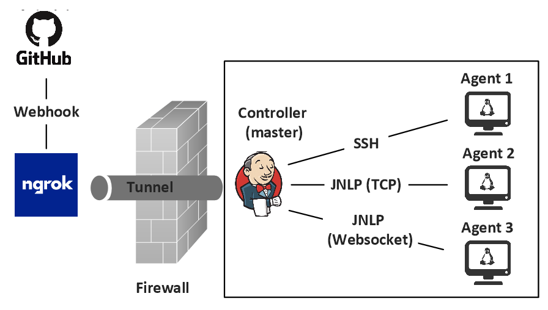
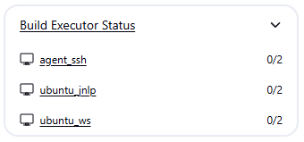
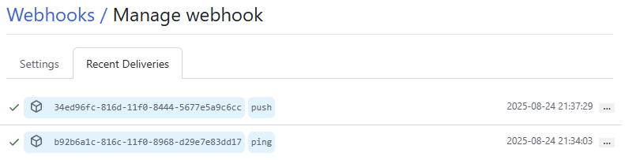
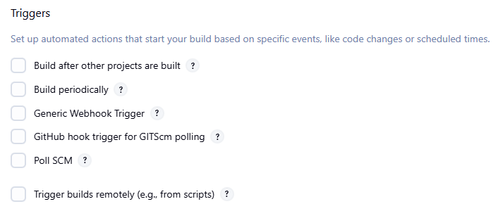

# Jenkins-Pipeline

This Jenkins Pipeline project implements a fully automated CI/CD environment using a Docker Compose stack with one Jenkins controller and three differently configured agents. GitHub webhooks notify Jenkins on every code push, triggering pipelines that perform source checkout, linting, static analysis, build, testing, and coverage reporting. This design achieves a portable, reproducible, and production-grade CI/CD setup that can be easily extended for real-world projects.

## System Architecture

This project deploys a Jenkins controller alongside three Linux-based agents using Docker Compose on a shared user-defined bridge network. The controller acts as the orchestration hub, responsible for scheduling builds, managing credentials, and exposing the Jenkins web UI. The three agents are provisioned in different ways (via SSH, JNLP over TCP, and JNLP over WebSocket) so that the system demonstrates the full spectrum of connection models Jenkins supports. Each service is addressable by container name, eliminating the need for host networking or fixed IP addresses.

The configuration is automated using **Jenkins Configuration as Code** (JCasC). Instead of manually creating nodes and credentials, the controller reads a declarative YAML file on startup that defines global settings, security configuration, plugins, and node definitions. At boot, the controller generates an SSH keypair for agent authentication, configures the SSH-based node, and extracts inbound secrets for JNLP agents into a mounted volume. An initialization script ensures all nodes are available before completing the bootstrap. This results in an idempotent, fully reproducible Jenkins environment suitable for ephemeral infrastructure.

Each agent type is purposefully distinct. The SSH agent accepts inbound SSH connections from the controller using the generated keypair, while the JNLP/TCP agent dials back to the controller over the classic remoting port 50000. The WebSocket agent connects over HTTP(S) using the `-webSocket` flag, bypassing the need for a dedicated TCP port. Together, these nodes cover common real-world scenarios such as NAT traversal, reverse proxies, and environments where only controller-initiated or agent-initiated communication is possible. Workspaces are persisted per agent, but all build tooling runs inside containers to ensure that host environments remain clean.

### Execution Flow

Jenkins controller execution flow:

1. `controller` container starts
2. Plugins are already installed (they were baked into the image at build time via `jenkins-plugin-cli`)
3. Entrypoint generates an SSH keypair into the mounted volume: `/keys/id_rsa` and `/keys/id_rsa.pub`
4. JCasC creates three permanent nodes, bootstraps security and creates the SSH credential `ssh-key` by reading `/keys/id_rsa`
5. `init.groovy.d` script waits for both inbound nodes to get created. It then reads the node's secret and writes it to `/keys/<node>.secret`

Jenkins SSH agent (agent 1) execution flow:

1. `agent_ssh` container starts
2. Installs SSH server, disables password authentication and enables public-key authentication
3. It creates `jenkins` user and enables password-less SSH by appending `/keys/id_rsa.pub` to `~jenkins/.ssh/authorized_keys`
4. Installs a JRE (the SSH launcher runs `java -jar agent.jar` on the agent)
5. Controller connects over SSH using the `ssh-key` credential and launches the remoting agent in `/home/jenkins/agent`

Jenkins inbound agents (agent 2 and 3) use the official `jenkins/inbound-agent` image with a small wrapper entrypoint. Jenkins inbound agents execution flow:

1. Waits for the controller to create secret file in `/keys/*.secret`
2. Exports `JENKINS_SECRET` from that file
3. Starts the standard jenkins-agent launcher
4. `agent_jnlp` connects over TCP 50000; `agent_jnlp_ws` connects over HTTP(S) 8080
5. Each agent connects inbound and the node comes online

### GitHub Webhook and Ngrok Integration

To enable continuous integration on each push, the setup integrates GitHub webhooks with Jenkins. A webhook is registered in the GitHub repository pointing to Jenkins' `/github-webhook/` endpoint. Because the controller typically runs in a local or containerized environment not accessible from the public internet, [Ngrok](https://ngrok.com/) is used to create a secure, public-facing HTTPS tunnel. Ngrok maps a stable external URL to the local Jenkins service, allowing GitHub to deliver webhook payloads reliably even without direct inbound connectivity to the host.

When a developer pushes to the [repository](https://github.com/ManiAm/primes-cpp), GitHub sends a JSON payload describing the event to the configured webhook URL. Ngrok forwards this POST request to the Jenkins controller, where the GitHub plugin validates the signature and determines which jobs should be triggered. The corresponding pipeline is scheduled on one of the agents, which then checks out the updated source code and executes the defined stages. This model eliminates polling delays and ensures that code changes are built and validated as soon as they are committed.

In practice, Ngrok should be configured with authentication and, ideally, a reserved domain to ensure the webhook URL remains consistent across restarts. The webhook itself should also be configured with a shared secret, allowing Jenkins to reject unauthorized or spoofed requests. Combined, this approach offers a lightweight yet production-safe mechanism for receiving GitHub events in otherwise private or firewalled Jenkins deployments.

## Getting Started

Start all containers:

    docker compose up -d --build

Open Jenkins UI:

    http://localhost:8081

Username is `admin` and password is saved in `/keys/admin_password`:

    docker exec -it controller cat /keys/admin_password

Once logged into the Jenkins UI, you will see all three configured agents, each provisioned with two executors. An executor represents a single parallel build slot on a node, allowing multiple jobs to run concurrently if the node has sufficient resources. Assigning two executors per agent means each agent can handle up to two builds in parallel.

The controller is intentionally configured with zero executors. This best practice ensures the controller remains dedicated to orchestration, scheduling, and managing build pipelines, rather than consuming its own resources to execute jobs. Offloading all build activity to agents improves stability, scalability, and isolates workloads from the controller’s core responsibilities.

### Setting up ngrok

Install ngrok using Snap:

    sudo snap install ngrok

Create an account in the [ngrok](https://ngrok.com/) website and obtain a token.

Run the following command to add your authtoken to the default `ngrok.yml` configuration file.

    ngrok config add-authtoken <your/authtoken>

Invoke ngrok on port 8081:

    ngrok http 8081

Make a note of the generated forwarding link:

    Forwarding  https://xxxxx.ngrok-free.app -> http://localhost:8081

### Setting up Github Webhook

Configure the GitHub webhook:

- Open your [repository](https://github.com/ManiAm/primes-cpp) and go to Settings → Webhooks.
- Click "Add webhook".
- Paste the ngrok URL above followed by the `github-webhook/` endpoint. Note the trailing slash.
- Select `application/json` as the content type.
- Choose the events you want to trigger the webhook such as "Just the push event".
- Click on "Add webhook".

When you add a webhook in GitHub, it automatically sends a `ping event` to the specified URL to verify that the webhook is correctly configured and reachable. This ping request contains a simple JSON payload with a `zen` message (a random GitHub proverb) and the hook object. It includes webhook details like its ID and configuration. If everythin is setup properly, you should see `200 OK` in the ngrok output.

### Jenkins Pipeline

A Jenkins Pipeline is a mechanism to define, manage, and execute CI/CD workflows using code rather than manual job configuration. Unlike traditional "freestyle" jobs where build steps are defined through the Jenkins UI, a pipeline is expressed in a script written in Groovy-based syntax and can describe anything from simple linear flows to complex, multi-stage processes.

There are multiple ways to define pipeline code, depending on how you want to manage it:

- **Pipeline Script**: The pipeline code is written directly into the Jenkins job configuration and stored on the Jenkins server. This approach is useful for quick experiments or one-off jobs, but it does not support versioning or branch-specific workflows.

- **Pipeline Script from SCM**: The pipeline code is stored in a `Jenkinsfile` that lives inside the project’s source repository. This allows the pipeline to evolve alongside the application code, supports branch-specific pipelines, and ensures changes are tracked in version control. For larger organizations, "Shared Libraries" can also be used to centralize reusable pipeline logic in a separate repository, with individual Jenkinsfiles invoking functions from that library.

As of version 2.5 of the Pipeline plugin, pipeline supports two discrete syntaxes:

- **Scripted Pipeline**: Scripted Pipeline is the original Jenkins Pipeline syntax, written entirely in Groovy. It provides maximum flexibility by allowing developers to use the full power of the Groovy language, including conditionals, loops, exception handling, and custom methods. Because of this, it is highly expressive and suitable for complex workflows, but it can also be harder to read and maintain, especially for teams without strong Groovy expertise. Scripted Pipelines are typically chosen when fine-grained control or dynamic behavior is required.

- **Declarative Pipeline**: Declarative Pipeline was introduced to simplify Pipeline authoring with a more opinionated, structured, and human-readable syntax. It enforces a defined hierarchy (such as `pipeline`, `stages`, and `steps`) and includes features like post conditions, built-in error handling, and parameter definitions directly in the pipeline. While less flexible than Scripted Pipeline, Declarative syntax is easier to learn, more maintainable, and generally preferred for most CI/CD workflows, particularly when consistency and readability are important across teams.

### Jenkins Pipeline Configuration

To create a new pipeline job, click on "New Item" in Jenkins and select "Pipeline".

Under the "Triggers" section, you can specify how the job should be triggered:

"GitHub hook trigger for GITScm polling" is provided by the [Github Jenkins plugin](https://plugins.jenkins.io/github/). It enables builds to run automatically when GitHub sends a post-receive webhook after code is pushed. "Generic Webhook Trigger" is provided by the [Generic Webhook Trigger](https://plugins.jenkins.io/generic-webhook-trigger/). It allows you to define custom conditions and extract parameters from the webhook payload. For this example, we will select the "GitHub hook trigger" option.

In the "Pipeline" section, choose "Pipeline script from SCM", select Git as the SCM, and set the repository URL to:

    https://github.com/ManiAm/primes-cpp

Leave the "Script Path" as Jenkinsfile (the default), since the file is stored at the root of the repository.

With this setup, when a user pushes code to the Primes-CPP repository, GitHub sends a webhook event to Jenkins. Jenkins then checks out the repository, locates the Jenkinsfile at the root, and executes the defined pipeline stages.
