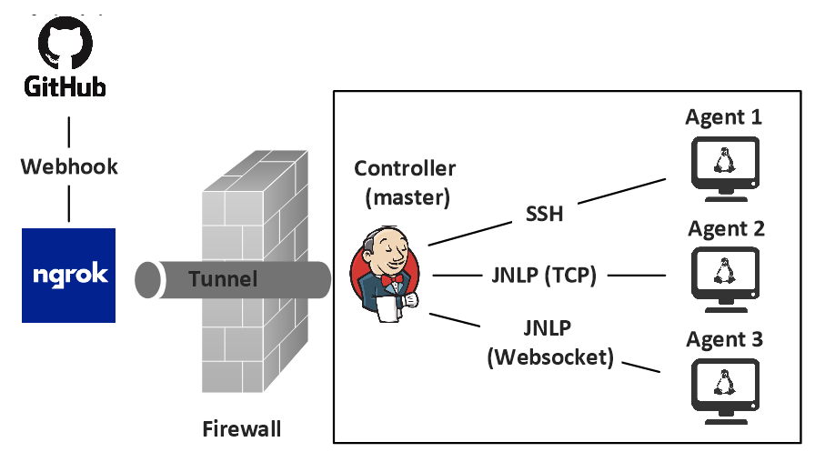
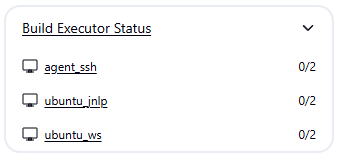

# Jenkins-Pipeline

This Jenkins Pipeline project implements a fully automated CI/CD environment using a Docker Compose stack with one Jenkins controller and three differently configured agents. GitHub webhooks notify Jenkins, triggering pipelines that perform source checkout, linting, static analysis, build, testing, and coverage reporting. This design achieves a portable, reproducible, and production-grade CI/CD setup that can be easily extended for real-world projects.

## System Architecture

This project deploys a Jenkins controller alongside three Linux-based agents using Docker Compose on a shared user-defined bridge network. The controller acts as the orchestration hub, responsible for scheduling builds, managing credentials, and exposing the Jenkins web UI. The three agents are provisioned in different ways (via SSH, JNLP over TCP, and JNLP over WebSocket) so that the system demonstrates the full spectrum of connection models Jenkins supports. Each service is addressable by container name, eliminating the need for host networking or fixed IP addresses.

The configuration is automated using **Jenkins Configuration as Code** (JCasC). Instead of manually creating nodes and credentials, the controller reads a declarative YAML file on startup that defines global settings, security configuration, plugins, and node definitions. At boot, the controller generates an SSH keypair for agent authentication, configures the SSH-based node, and extracts inbound secrets for JNLP agents into a mounted volume. An initialization script ensures all nodes are available before completing the bootstrap.

Each agent type is purposefully distinct. The SSH agent accepts inbound SSH connections from the controller using the generated keypair, while the JNLP/TCP agent dials back to the controller over the classic remoting port 50000. The WebSocket agent connects over HTTP(S) using the `-webSocket` flag, bypassing the need for a dedicated TCP port. Together, these nodes cover common real-world scenarios such as NAT traversal, reverse proxies, and environments where only controller-initiated or agent-initiated communication is possible.

### Execution Flow

Jenkins controller execution flow:

1. `controller` container starts
2. Plugins are already installed (they were baked into the image at build time via `jenkins-plugin-cli`)
3. Entrypoint generates an SSH keypair into the mounted volume: `/keys/id_rsa` and `/keys/id_rsa.pub`
4. JCasC creates three permanent nodes, bootstraps security and creates the SSH credential `ssh-key` by reading `/keys/id_rsa`
5. `init.groovy.d` script waits for both inbound nodes to get created. It then reads the node's secret and writes it to `/keys/<node>.secret`

Jenkins SSH agent (agent 1) execution flow:

1. `agent_ssh` container starts
2. Installs SSH server, disables password authentication and enables public-key authentication
3. It creates `jenkins` user and enables password-less SSH by appending `/keys/id_rsa.pub` to `~jenkins/.ssh/authorized_keys`
4. Installs a JRE (the SSH launcher runs `java -jar agent.jar` on the agent)
5. Controller connects over SSH using the `ssh-key` credential and launches the remoting agent in `/home/jenkins/agent`

Jenkins inbound agents (agent 2 and 3) use the official `jenkins/inbound-agent` image with a small wrapper entrypoint. Jenkins inbound agents execution flow:

1. Waits for the controller to create secret file in `/keys/*.secret`
2. Exports `JENKINS_SECRET` from that file
3. Starts the standard jenkins-agent launcher
4. `agent_jnlp` connects over TCP 50000; `agent_jnlp_ws` connects over HTTP(S) 8080
5. Each agent connects inbound and the node comes online

### GitHub Webhook and Ngrok Integration

The setup integrates GitHub webhooks with Jenkins. A webhook is registered in the GitHub repository pointing to Jenkins' `/github-webhook/` endpoint. Because the controller runs in a local environment not accessible from the public internet, [Ngrok](https://ngrok.com/) is used to create a secure, public-facing HTTPS tunnel. Ngrok maps a stable external URL to the local Jenkins service, allowing GitHub to deliver webhook payloads reliably even without direct inbound connectivity to the host.

When a developer pushes to the application repository, GitHub sends a JSON payload describing the event to the configured webhook URL. Ngrok forwards this POST request to the Jenkins controller, where the GitHub plugin validates the signature and determines which jobs should be triggered. The corresponding pipeline is scheduled on one of the agents, which then checks out the updated source code and executes the defined stages. This model eliminates polling delays and ensures that code changes are built and validated as soon as possible.

## GitHub ↔ Jenkins Development Flow

### Scenario A - Unprotected `main` branch

With an open `main` branch, any committer can push directly to the default branch. Each push fires a GitHub webhook to Jenkins. Jenkins then pulls the new commit on `main` and runs the pipeline defined in your Jenkinsfile. The feedback loop is very short: developers finish a change, push, and immediately see CI results for the trunk. Deploy stages will typically be gated to "only when branch == main" and therefore can run automatically after each successful push.

This model is simple to operate and easy to explain. There’s no PR ceremony, no merge queues, and minimal branching overhead. For very small teams or solo projects where speed matters more than process, it can be effective. It also aligns with "pure" trunk-based development when the team is disciplined, tests are fast and reliable, and feature flags are used to avoid breaking user-facing behavior.

However, the risk profile is high. Any mistake on `main` breaks the branch every other developer is pulling from, potentially blocking the team. There’s no enforced peer review or required checks prior to the change landing on trunk, so quality, security, and compliance guards must be enforced after the fact (post-merge), which is too late if the pipeline catches critical issues. Auditing is weaker (no formal review artifact), and reverting/repairing under time pressure becomes common. If deployments are coupled to `main`, a bad push can cascade into production incidents. In practice, teams end up pausing work while waiting for trunk to be fixed.

Pros

- Fastest path from commit → CI → deploy.
- Minimal process overhead; good for prototypes, internal tooling, or solo work.
- No PR queue contention; fewer merge conflicts due to short-lived work.

Cons

- High risk of breaking trunk; everyone is affected immediately.
- No enforced review/quality gates before code lands.
- Weaker audit trail and compliance posture.
- Harder to manage secrets and deployment safety if CI/CD auto-runs on every push.
- Cultural burden: relies on strict discipline, feature flags, and excellent tests.

### Scenario B - Protected `main` branch with PR workflow

The `main` branch is protected and direct pushes are blocked. Developers branch off `main`, commit locally, push their feature/bugfix branch, then open a Pull Request. GitHub sends pull_request (and branch push) webhooks to Jenkins. In a Multibranch Pipeline, Jenkins discovers the PR and runs the Jenkinsfile in a PR context. Jenkins reports pass/fail, alongside test results, coverage, and static analysis.

This model puts quality gates before changes reach trunk. You can require one or more code reviews, enforce green Jenkins checks, and even mandate security scans or coverage thresholds. The PR becomes the canonical audit artifact (who approved, what changed, what tests ran), which is valuable for regulated environments. After approval and passing checks, the PR is merged (merge/rebase/squash commit per policy), which triggers a fresh Jenkins run on `main` where production-grade stages (sign, package, publish, deploy) can execute safely.

The tradeoff is additional process and potential latency. PR queues can form, reviews can be slow, and flaky tests can block merges. Teams must maintain Multibranch configuration and branch protection rules, and developers must keep branches fresh (rebase/merge from main) when the repo is busy. Still, for most multi-person teams, the reliability and audit gains far outweigh the overhead.

Pros

- Quality gates pre-merge: enforced reviews, required status checks.
- Strong auditability (who approved, which checks passed).
- Safer deployments: only merged, validated code hits main.
- Supports preview environments and merge-queue automation.
- Better fit for security/compliance and larger teams.

Cons

- More ceremony and potentially longer cycle times.
- PR queues and flaky tests can slow merges.
- Secrets and CI permissions are trickier for forked PRs.
- Requires active repo hygiene (rebasing, conflict resolution).

## Jenkins Pipeline

A Jenkins Pipeline is a mechanism to define, manage, and execute CI/CD workflows using code rather than manual job configuration. Unlike traditional "freestyle" jobs where build steps are defined through the Jenkins UI, a pipeline is expressed in a script written in Groovy-based syntax and can describe anything from simple linear flows to complex, multi-stage processes.

There are multiple ways to define pipeline code, depending on how you want to manage it:

- **Pipeline Script**: The pipeline code is written directly into the Jenkins job configuration and stored on the Jenkins server. This approach is useful for quick experiments or one-off jobs, but it does not support versioning or branch-specific workflows.

- **Pipeline Script from SCM**: The pipeline code is stored in a `Jenkinsfile` that lives inside the project’s source repository. This allows the pipeline to evolve alongside the application code, supports branch-specific pipelines, and ensures changes are tracked in version control. For larger organizations, "Shared Libraries" can also be used to centralize reusable pipeline logic in a separate repository, with individual Jenkinsfiles invoking functions from that library.

As of version 2.5 of the Pipeline plugin, pipeline supports two discrete syntaxes:

- **Scripted Pipeline**: Scripted Pipeline is the original Jenkins Pipeline syntax, written entirely in Groovy. It provides maximum flexibility by allowing developers to use the full power of the Groovy language, including conditionals, loops, exception handling, and custom methods. Because of this, it is highly expressive and suitable for complex workflows, but it can also be harder to read and maintain, especially for teams without strong Groovy expertise. Scripted Pipelines are typically chosen when fine-grained control or dynamic behavior is required.

- **Declarative Pipeline**: Declarative Pipeline was introduced to simplify Pipeline authoring with a more opinionated, structured, and human-readable syntax. It enforces a defined hierarchy (such as `pipeline`, `stages`, and `steps`) and includes features like post conditions, built-in error handling, and parameter definitions directly in the pipeline. While less flexible than Scripted Pipeline, Declarative syntax is easier to learn, more maintainable, and generally preferred for most CI/CD workflows, particularly when consistency and readability are important across teams.

In Jenkins, pipelines can be configured using two primary job types, each suited to different workflows:

- **"Pipeline" Job Type**: A Pipeline job is a single Jenkins job that points to one repository (or one branch). You configure it with either a Jenkinsfile stored in source control, or a pipeline script directly in Jenkins UI. This job listens for webhooks (e.g., push events) and runs whenever new commits are pushed to the tracked branch. You often configure it to watch `main` only. This setup fits **Scenario A** above because developers push directly to `main`, and you only need Jenkins to build that branch. Each commit to trunk will retrigger the pipeline automatically. The simplicity here matches the lightweight workflow: one branch, one job, one CI signal.

- **"Multibranch Pipeline" Job Type**: A Multibranch Pipeline job is more advanced. Jenkins auto-discovers branches and pull requests from the repository and creates sub-jobs for each. Every branch and every PR gets its own job automatically. Jenkins executes the Jenkinsfile from that branch or PR context. This is the natural fit for **Scenario B** above. Developers create branches, push, then open a PR. GitHub sends both push and pull_request webhooks. Jenkins picks up the new branch and the PR and runs CI on each.

## Reporting Build Results to GitHub

GitHub provides multiple mechanisms for external CI/CD systems to integrate with its platform and report build or test results back to developers. The two primary interfaces for this purpose are the [Commit Status API](https://docs.github.com/en/rest/commits/statuses) and the newer [Checks API](https://docs.github.com/en/rest/checks), both accessible via the GitHub REST API.

### Commit Status API

The Commit Status API allows an external system such as Jenkins to attach a simple status to a specific commit SHA. Each status includes a state (`pending`, `success`, `failure`, or `error`), a context string to identify the reporting system (e.g., `ci/jenkins`, `lint/eslint`), and optional metadata such as a description or a URL to detailed logs. These statuses appear directly on commits and pull requests, enabling teams to enforce branch protection rules that block merges until all required statuses are successful. While widely supported, this API is limited to basic pass/fail indicators and does not natively provide detailed test results or inline feedback.

### Checks API

The Checks API was introduced to overcome the limitations of commit statuses by offering a richer and more structured reporting model. It introduces the following concepts:

- **Check Runs**: individual reports tied to a commit
- **Check Suites**: collections of runs, typically associated with one CI provider

A check run can report multiple states (`queued`, `in_progress`, `completed`) and conclusions (`success`, `failure`, `neutral`, `timed_out`, etc.), along with detailed output including summaries, markdown-formatted text, and file-level annotations for warnings or errors. The Checks API also supports advanced interactions such as the ability for users to re-run checks directly from the GitHub UI. This level of granularity provides developers and reviewers with deeper visibility into the CI/CD process, making it easier to diagnose failures and enforce higher-quality standards before merging code.

## GitHub Checks plugin for Jenkins

The [GitHub Checks](https://plugins.jenkins.io/github-checks/) plugin for Jenkins is an extension that allows Jenkins to use GitHub’s Checks API when reporting build results back to GitHub. In practice, this means that instead of just a simple green checkmark or red X tied to a commit, Jenkins can publish rich build information directly into the GitHub Pull Request "Checks" tab. This can include build summaries, test results, code coverage metrics, static analysis warnings, and even inline file annotations pointing out exactly where a problem occurred.

The plugin builds on the [Checks API](https://plugins.jenkins.io/checks-api/) framework inside Jenkins. It provides a publisher implementation specifically for GitHub, so any job running against a GitHub repository can report its results as Checks. It also supports the "re-run" functionality: when a GitHub user clicks Re-run checks on a failing Jenkins check in the PR UI, GitHub sends a "check_run:rerequested" event back to Jenkins, and Jenkins automatically restarts the build for that commit. This makes the workflow much tighter. Developers don’t need to leave GitHub or manually retrigger jobs in Jenkins when CI fails due to flakiness or environment issues.

We need the GitHub Checks plugin because modern GitHub branch protection rules and developer workflows expect rich feedback in the "Checks" tab, not just raw commit statuses. With this plugin, Jenkins becomes a first-class citizen in the GitHub ecosystem, on par with other CI providers like GitHub Actions. It enhances visibility for reviewers, enforces quality gates through branch protection, and reduces context switching for developers.

## Authentication Methods for Jenkins-GitHub Integration

### Personal Access Tokens (PATs)

A Personal Access Token (PAT) is a credential tied to a specific GitHub user account. It acts like a password substitute for API calls, allowing Jenkins (or any tool) to authenticate on behalf of that user. PATs are easy to create from a user’s GitHub profile and can be granted broad scopes such as `repo`, `workflow`, or `admin:org`.

PATs work well for simple integrations like cloning repositories or posting commit statuses (the older "Status API"). However, because they inherit the full privileges of the user who created them, PATs can become a security risk if over-scoped or leaked. They also tend to be long-lived and manually managed, making them harder to rotate or restrict to specific repositories. In modern GitHub practice, PATs are increasingly considered a "legacy" approach for service-to-service integration.

### GitHub Apps

A GitHub App is GitHub’s modern, secure integration model designed for external systems like Jenkins. Unlike PATs, a GitHub App is not tied to a user. Instead, it exists as an independent identity that you install on organizations or repositories. The App only receives access to those repositories and only for the specific permissions you select.

Each GitHub App uses a private key and "App ID" to generate short-lived installation tokens, making authentication safer and more auditable. Apps can also receive their own webhooks (e.g., "check_run.rerequested"), which allows Jenkins to respond to GitHub events in real time. GitHub requires Apps not PATs for the Checks API, meaning you must use a GitHub App if you want Jenkins to publish rich PR checks, annotations, and support the "Re-run" button.

## Getting Started

Start all containers:

    docker compose up -d --build

Open Jenkins UI:

    http://localhost:8081

Username is `admin` and password is saved in `/keys/admin_password`:

    docker exec -it controller cat /keys/admin_password

Once logged into the Jenkins UI, you will see all three configured agents, each provisioned with two executors. An executor represents a single parallel build slot on a node, allowing multiple jobs to run concurrently if the node has sufficient resources. Assigning two executors per agent means each agent can handle up to two builds in parallel.

The controller is intentionally configured with zero executors. This best practice ensures the controller remains dedicated to orchestration, scheduling, and managing build pipelines, rather than consuming its own resources to execute jobs. Offloading all build activity to agents improves stability, scalability, and isolates workloads from the controller’s core responsibilities.

### Setting up ngrok

Install ngrok using Snap:

    sudo snap install ngrok

Create an account in the [ngrok](https://ngrok.com/) website and obtain a token.

Run the following command to add your authtoken to the default `ngrok.yml` configuration file.

    ngrok config add-authtoken <your/authtoken>

Invoke ngrok on port 8081:

    ngrok http 8081

Make a note of the generated forwarding link:

    Forwarding  https://xxxxx.ngrok-free.app -> http://localhost:8081

### Setting up Github Webhook

Configure the GitHub webhook:

- Open your [repository](https://github.com/ManiAm/primes-cpp) and go to Settings → Webhooks.
- Click "Add webhook".
- Paste the ngrok URL above followed by the `github-webhook/` endpoint. Note the trailing slash.
- Select `application/json` as the content type.
- Choose the events you want to trigger the webhook based on the scenario [above](#github--jenkins-development-flow):
    - Scenario A: "Just the push event"
    - Scenario B: "Let me select individual events" -> "Pull requests"
- Click on "Add webhook".

When you add a webhook in GitHub, it automatically sends a `ping event` to the specified URL to verify that the webhook is correctly configured and reachable. This ping request contains a simple JSON payload with a `zen` message (a random GitHub proverb) and the hook object. It includes webhook details like its ID and configuration.

If everythin is setup properly, you should see `200 OK` in the ngrok output.

### Setting up Pipeline Job (Scenario A)

Click on "New Item" in Jenkins and select "Pipeline".

Under the "Triggers" section, you can specify how the job should be triggered:

"GitHub hook trigger for GITScm polling" is provided by the [Github Jenkins plugin](https://plugins.jenkins.io/github/). It enables builds to run automatically when GitHub sends a post-receive webhook after code is pushed. "Generic Webhook Trigger" is provided by the [Generic Webhook Trigger](https://plugins.jenkins.io/generic-webhook-trigger/). It allows you to define custom conditions and extract parameters from the webhook payload. For this example, we will select the "GitHub hook trigger" option.

In the "Pipeline" section, choose "Pipeline script from SCM", select Git as the SCM, and set the repository URL to:

    https://github.com/ManiAm/primes-cpp

Leave the "Script Path" as Jenkinsfile (the default), since the file is stored at the root of the repository.

With this setup, when a user pushes code to the `main` branch, GitHub sends a webhook event to Jenkins. Jenkins then checks out the repository, locates the Jenkinsfile, and executes the defined pipeline stages.

### Setting up Multibranch Pipeline Job (Scenario B)

Click on "New Item" in Jenkins and select "Multibranch Pipeline".

Under branch sources, select "Github" as the source.

Set repositry HTTP(s) URL to:

    https://github.com/ManiAm/primes-cpp

Configure the Behaviors as follows:

- Remove "Discover branches" (click the "×") to avoid building feature branches directly
- Discover pull requests from origin → Strategy: Merging the pull request with the current target revision
- Discover pull requests from forks → Strategy: Merging the pull request with the current target revision
- Click Save to complete the configuration

With this setup, Jenkins builds are triggered only when a pull request is opened or updated against the `main` branch. Let us go over a sample workflow.

1. A developer creates a feature branch and pushes it to GitHub:

        git checkout -b feature-2
        # make changes
        git add -u
        git commit -m "Feature updates"
        git push origin feature-2

    Actions above do not trigger Jenkins directly.

2. The developer opens a pull request from `feature-2` into `main`.

    - GitHub sends a pull_request webhook event to Jenkins.
    - Jenkins creates a `PR-###` job and runs the pipeline against the PR merge ref.

3. If the developer pushes new commits to `feature-2` after the PR is open:

    - GitHub fires a pull_request (synchronize) event.
    - Jenkins reruns the PR job to validate the updated code.

This ensures Jenkins only runs in the context of pull requests, providing reliable validation before changes reach the protected `main` branch.

### Setting up "Github Checks" Plugin

Create a Github App under your personal account:

- Go to Profile → Settings → Developer settings → GitHub Apps
- Click on "New GitHub App"
- Set app name. Note that the GitHub App name must be globally unique across all of GitHub, not just within your account or organization.
- Set Homepage URL - your company domain or a github repository
- Webhook URL - the ngrok URL above followed by the `github-webhook/` endpoint
- Permissions this plugin uses:
    - Checks - Read and Write
    - Commit statuses - Read and Write
    - Contents: Read-only (to read the Jenkinsfile and the repository content during git fetch)
    - Metadata: Read-only (always granted)
    - Pull requests: Read-only
- Under Subscribe to events, enable all events
- Click 'Create GitHub app'
- Click the 'generate a private key' option
- The private key file (`.pem`) will be downloaded on your local machine
- From the "Install App" section of newly created app, install the app

The `.pem` file downloaded above is in PKCS#1 (RSA Private Key) format by default. Some Jenkins plugins expect the key in PKCS#8 format. You can perform this conversion using:

        openssl pkcs8 -topk8 -inform PEM -outform PEM -in key-in-your-downloads-folder.pem -out converted-github-app.pem -nocrypt

Open Jenkins and perform the following configurations:

- Add GitHub App credentials by going to Manage Jenkins → Credentials → Global → Add Credentials
- Kind: GitHub App
- ID: Specify a name such as "github-app"
- App ID: the github app ID, it can be found in the 'About' section of your GitHub app in the general tab.
- Key: click add, paste the contents of the converted private key
- Click Ok

Go to the existing Multibranch Pipeline job, and click Configure:

- Click Credentials. Pick the GitHub App credential above.
- Add "Status Checks Properties" Behavior, and enable "Skip GitHub Branch Source notifications"
- Apply and save the changes.

Enforce blocking on GitHub:

- Repo → Settings → Branches → Branch protection rules (for `main`).
- Enable Require a pull request before merging.
- Enable Require status checks to pass before merging → Choose required checks (select your Jenkins check names).

Now, when a pull request is opened, GitHub displays the Jenkins build stages and their status in real time. Each stage’s progress and result are visible directly on the PR. Merging into the protected branch is only permitted once all Jenkins stages have completed successfully, ensuring that no unverified or failing code can be merged.

Clicking on a stage in GitHub redirects you to the corresponding Jenkins interface, where you can review detailed logs, artifacts, and execution history.

